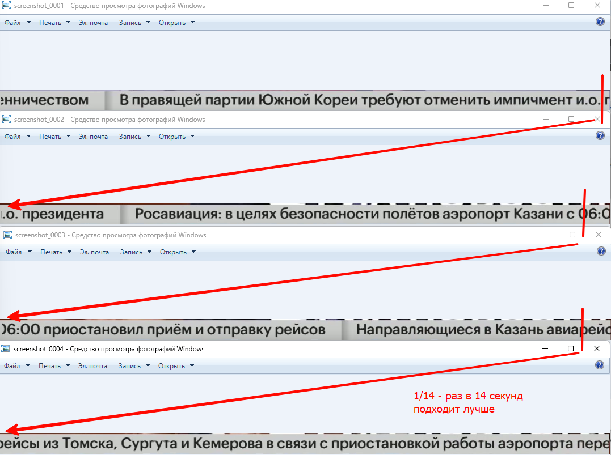
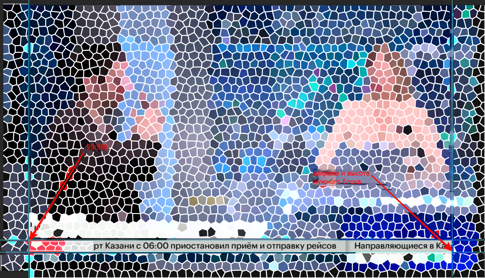

# Получение текста из бегущей строки видео потока

## Принцип работы

1. Получение скриншотов из видео потока, отдельным скриптом ```screenshot_capture.py``` необходимо держать всегда запущенным 
2. Парсинг файлов скриншотов и получение текста с картинки, скриптом ```screenshot_parser.py``` запускать в зависимости от сохраненных файлов

# 1. Получение скриншотов из видео потока

Для работы необходима установленная программа на устройстве ```ffmpeg``` ([пример установки](https://www.geeksforgeeks.org/how-to-install-ffmpeg-on-windows/)) В зависимости от операционной системы указать путь до ffmpeg ```c:/ffmpeg/bin/ffmpeg.exe``` для Unix систем найти нужное

Находим необходимую ссылку на [видео поток](https://rutube.ru/play/embed/88f6485ee28d56daf13302ac6fe3d931) 

На странице необходимо найти ссылку на [m3u8](https://salam-mskm9-2.rutube.ru/dive/river-5-515.rutube.ru/g-G5fbla4D0c_GlaQ8Yw_A/stream/genetta-532.ost.rutube.ru/Bf1s4eNUnwfur99kDiLwuw/1735971924/88f6485ee28d56daf13302ac6fe3d931/1080p_stream.m3u8)

При просмотре необходимо определить тайминг бегущей строки (чтобы было меньше дублей слов), после нахождения выставить тайминг для фильтра ```fps=1/14``` один раз в 14 секунд



Для того чтобы не сохранять весь скриншот, необходимо [обрезать](https://annimon.com/article/3995) скриншот по бегущей строки



Обрезка происходит фильтром ```crop=1474:50:353:958```
* ```353:958``` - начальная точка от которой начинаем обрезку
* ```1474:50``` - размер вырезаемого блока

Запуск [процесса](https://stackoverflow.com/questions/72738553/how-can-i-run-an-ffmpeg-command-in-a-python-script) получения скриншотов

# 2. Парсинг файлов скриншотов и получение текста с картинки

## Скриншоты размещаются в каталоге screenshots

Каждый файл представляет собой фотографию содержащую текст. Текст должен быть читаем, если плохого качества, распознавание будет плохим.

## Обходит указанный каталог и возвращает список полных путей ко всем файлам.

Получаем каждый файл и передаем на распознавание

## Каждый файл передаем на распознание текст на картинке и возвращаем строку

Распознавание происходит с помощью библиотеки ```easyocr``` (после установки проект увеличивается в объеме на 1,5 Гб) После первого запуска скачивается необходимая модель в зависимости от ```easyocr.Reader(['ru'], gpu=True)``` указанного языка (необходимо время, в последующие разы это не требуется), если не указывать ```gpu=True``` автоматически определяется, есть ли возможность использовать видеокарту, если нет то используется CPU

```TODO:``` Необходимо добавить удаление отработанных файлов

Полученный текст передается далее для вставки в таблицу

## Вставляем строку в таблицу public.running_strings

Для проекта необходима база данных PostgreSQL  

Для работы необходима таблица с такой структурой

```
CREATE TABLE public.running_strings (
  id serial NOT NULL,
  time_c timestamp NULL,
  "text" text NULL
);
```

## Опции работы скрипта

В скрипте есть переменная ```debug``` если равняется ```True``` то в консоль выводится отладочная информация

